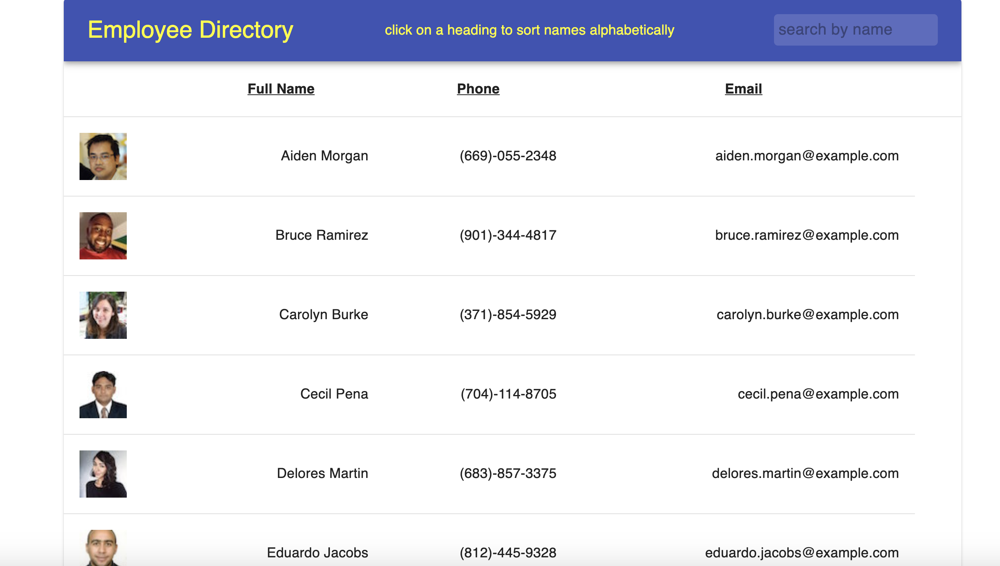

## **Employee-Directory**
------

## **Live Link**

<h2><a href ="https://drive.google.com/file/d/1LtAHbfWxhIj9O96LdJ-hYoN1SNhl8ob4/view">Live Link</a></h2>

## **Description**
This is an app that allows a user to sort and search for employees in an employee direcotry. The user can sort the user names alphabetically by clicking on one of the three headings on the table. The user can search for an employee by entering their name in the search field. This app utilizes a API to populate random employees to create the directory.

## **Technology Stack**
* React
* JavaScript
* Node.js
* GitHub
* APIs

## **Screenshots**

## **Test**

  

## **Usage**

This application allows a user to sort and search through a direcotry of employees. 

## **Contributors/Contact**

#### **Jessica Helft** 
* [@KingKitty89](https://github.com/KingKitty89)
* [Portfolio](https://kingkitty89.github.io/ResponsivePortfolio/)
* [jessicahelft@gmail.com](jessicahelft@gmail.com)
* [LinkedIn](https://www.linkedin.com/in/jessicahelft)
